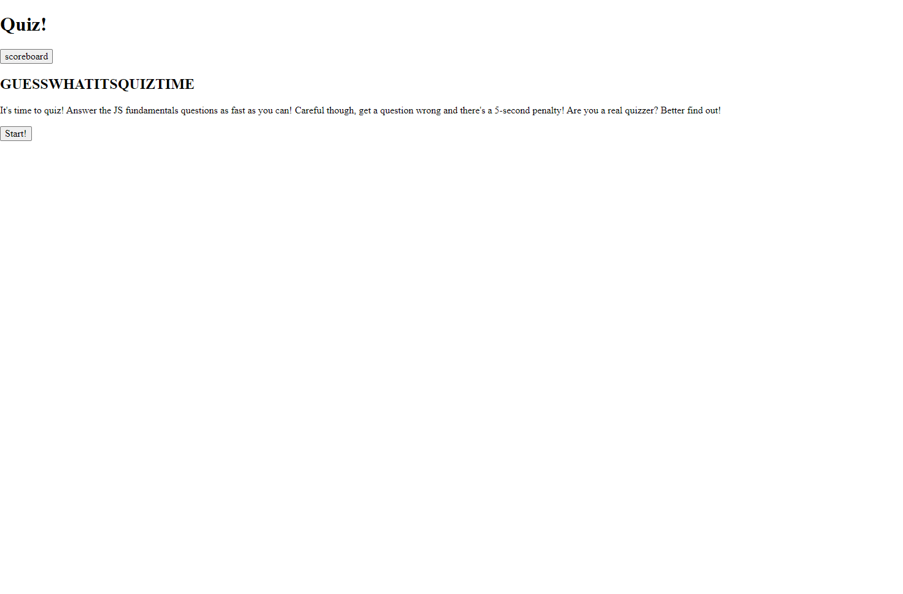

# <Challenge 4: Code Quiz>

## Description

- In this project, we have been tasked with making a timed quiz on Javascript fundamentals.
- The transition functions and actual quiz functions mostly tapped our knowledge of DOM traversal to find elements and setting their attributes through js, and also included implementation of event listeners an interval-based timer.
- The initials entry page after the quiz collected the user's input, combining it with the timer's remaining value in an object. The object was pushed to an array with any previously gathered objects, which were all set to local storage for future reference.
- The scoreboard was the most challenging piece. When called on, the stored objects would first be sorted by score value from greatest to least. Then, for each object, js was used to create a li element in the html in which the object's values could be posted.
- This was the most challenging project we've undertaken so far, but in all it was an excellent and rewarding exercise.

## Usage

- To use the quiz game, first navigate to the webpage. At time of publication, the project can be found deployed at https://dopalescent.github.io/Quiz-Game/
- Once there, you will see the start page. It will have a description of the quiz and options to navigate to the scoreboard or to start the quiz. Navigating to the scoreboard without any attempts to the quiz will show an empty scoreboard with an option to navigate back to the start screen.
- Clicking the "Start!" button on the start page will transition the browser to the quiz page, at which time the timer will start and the quiz will begin.
- The quiz page features a line of text with the first question and a selection of four answers to choose from. When an answer is clicked, the correct answer will be hilighted green. If the correct answer was clicked, a line of feedback text below will read "Correct!" If an incorrect answer was clicked it will be hilighted red, the feedback text will read "Nope!", and five seconds will be subtracted from the timer. In both instances a button reading "Next Question!" will then appear.
- On clicking the "Next Question!" button, the quiz page text will change to the next question, and the answer options will transition accordingly. Any higlighted answers and feedback text will be reset, and the "Next Question!" button will be hidden again. This process is repeated until four questions have been answered. On answering the fourth question, the button appearing below will instead read "Finish!" Clicking this button will transition the browser to the victory page. If the timer reaches zero before the "Finish!" button is clicked, the browser will transition to the victory page automatically.
- On transitioning to the victory page, there will be an input line prompting the user to enter their initials, as well as a button reading "Submit!" Entering a short string into the input line and clicking the button will transition the browser to the scoreboard page. Refreshing the browser at any point before clicking the "Submit!" button will return the user to the start page without any of their attempt data being saved.
- The scoreboard page will show a list of initials paired with their associated scores. Each score is the remaining value of the timer upon clicking the "Finish!" button on a given attempt. The entries on the scoreboard will be ordered by score in descending order. The current scoreboard will also be set to local storage, and will be called if the page is refreshed. Clicking the button at the bottom of the screen will return the user to the start page. By this point the quiz will have been reset and can be re-attempted.

- The following screenshot previews the deployed project:

## Credits

- Penn LPS Boot Camp program for education and resources
- MDN Web Docs for their useful references
- InterviewBit for their library of JS multiple-choice questions
- EdX and The Full-Stack Blog for their 'Professional README Guide' article